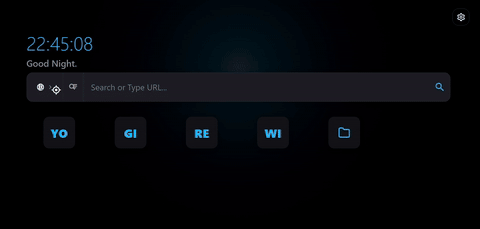
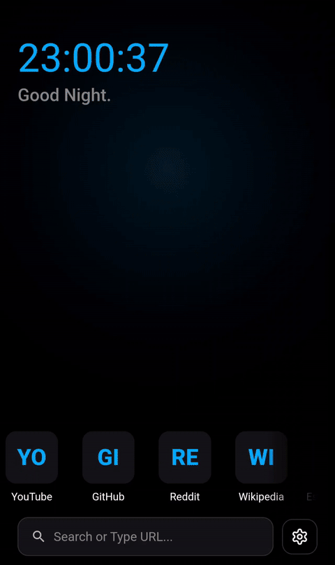

  
  <h1>0FluffStart</h1>
  
<i>The high-performance, minimalist productivity engine.</i>

  
<b>The Final Minimalist Dashboard for Desktop & Mobile.</b>

  

[**🚀 Launch Web Version**](https://jbuilds-g.github.io/0FluffStart/)

---

## 📖 Overview

0FluffStart is built on a **Zero-Fluff** philosophy: no trackers, no backend latency, and zero dependencies.

- **Desktop:** A fully integrated browser extension (Manifest V3) or standalone start page.
- **Mobile & Web:** A high-performance **Progressive Web App (PWA)** that works offline and installs natively on mobile devices.

---

## 📸 Demo

|                     💻 Desktop Experience                      |                    📱 Mobile Experience                     |
| :------------------------------------------------------------: | :---------------------------------------------------------: |
|  |  |

---

## 🔥 Key Features

<b>⚡ Performance & Architecture</b>

 

| Feature | Description |
| :--- | :--- |
| **GPU-Accelerated Rendering** | Global hardware acceleration and optimized CSS compositing layers ensure fluid 60fps interaction dynamics. |
| **Privacy-First Design** | Zero telemetry, tracking scripts, or cloud dependencies. All user data, settings, and history remain strictly on local hardware. |
| **Offline-Ready PWA** | Instant execution and offline functionality powered by Service Worker caching algorithms. |
| **Ultra-Minimalist Engine** | Built with 100% Vanilla HTML5, CSS3, and modern ES modules—zero external dependencies or heavy frameworks. |

<b>🔍 Search Interface & Autocomplete</b>

 

| Feature | Description |
| :--- | :--- |
| **Modular Search Engine** | Toggle between a unified search container and a segmented floating layout with individual control visibility flags. |
| **Inline Quick Suggestion Switcher** | Direct inline toggle control for live autocomplete suggestion feeds inside the search bar switcher. |
| **Multi-Engine Routing & Shortcuts** | Instant engine switching via prefix tags (`?g`, `?d`, `?b`) or dropdown selection with private LRU query caching. |

<b>🎨 Personalization, Themes & Media</b>

 

| Feature | Description |
| :--- | :--- |
| **Material You Extraction Engine** | Dynamic Monet HSL color extraction from custom uploaded background imagery and video loops. |
| **Local Media Storage & Serialization** | Upload high-resolution media directly to IndexedDB with base64 JSON backup and restore capabilities. |
| **Theme Presets & Custom Cursor** | Includes light, dark, and OLED aesthetic presets paired with a theme-adaptive vector cursor engine. |

<b>📁 Link Management & Organization</b>

 

| Feature | Description |
| :--- | :--- |
| **Hierarchical Folder Tree** | Create, edit, and recursively nest shortcut links inside custom folders up to 3 levels deep. |
| **Spatial Drag-and-Drop** | Native pointer-events reordering engine with auto-scrolling container boundaries and circular hierarchy checks. |
| **Batch Selection Toolbar** | Multi-item selection mode to move, reorganize, or delete links simultaneously. |

---

## 🛠️ Deployment & Installation

### Desktop (Browser Extension)

#### **Firefox**

1. Install directly from the Firefox Add-ons Store

2. Alternatively, download the latest`0FluffStart-(version).xpi` from [Releases](https://github.com/jbuilds-g/0FluffStart/releases/latest) and drag/drop it into Firefox (or open `about:addons` → Gear Icon → _Install Add-on From File..._).

#### **Chromium (Chrome, Edge, Brave)**

- **Chrome Web Store:**
- _(Coming soon)_
- **Manual Unpacked Loading:**
  - Download `0fluffstart-chrome-(version)zip` from the [Releases](https://github.com/jbuilds-g/0FluffStart/releases/latest).
  - Extract the archive to a local directory.
  - Open `chrome://extensions` in your browser.
  - Enable **Developer Mode** in the top-right corner.
  - Click **Load Unpacked** and select the extracted folder.

### Mobile & Live Web (PWA)

The hosted version is a fully compliant **PWA**, meaning it can be installed as a standalone app that works even without an internet connection.

#### Android (Chrome)

1.  Navigate to the [Live URL](https://jbuilds-g.github.io/0FluffStart/).
2.  Tap the three dots (Menu) and select **Add to Home Screen**.
3.  The dashboard will appear in your app drawer as a native application.

_alternatively_

> It can be set as a custom homepage.

1. Open **settings**.
2. Navigate to **Homepage** and turn it **on**.
3. Type or paste the **live URL** `jbuilds-g.github.io/0FluffStart/`

#### Firefox

1. Open **Settings** in Firefox.
2. Select **Homepage** -> **Custom URL**.
3. Type or paste the **Live URL**: `https://jbuilds-g.github.io/0FluffStart/`
4. Tap **Set**. New tabs and homepage opens will now load the dashboard directly.

---

### Mobile & Web (PWA)

#### **Chrome (Android)**

- **Option A (PWA App):** Go to the [Live App](https://jbuilds-g.github.io/0FluffStart/), tap the menu (⋮), and select **Add to Home Screen**.
- **Option B (Homepage):** Go to **Settings** → **Homepage** → turn **On** → paste `https://jbuilds-g.github.io/0FluffStart/`.

#### **Firefox**

1. Go to **Settings** → **Homepage** → **Custom URL**.
2. Paste `https://jbuilds-g.github.io/0FluffStart/` and tap **Set**.

#### **Safari (iOS)**

1. Open the [Live App](https://jbuilds-g.github.io/0FluffStart/) in Safari.
2. Tap **Share** → **Add to Home Screen**.

> [!IMPORTANT]
> **Update Policy:**
>
> - **PWA / Web:** Updates automatically via Service Worker when online.
> - **Browser Extension:** Requires manual updating by replacing the local folder with new release files.

---

## 💾 Data Sync & Management

Data is stored locally in `localStorage` and `IndexedDB`. Background media images and videos are serialized directly into base64 JSON backups.

1. **Export:** Go to _Settings > Data Management_ → Click **Backup (Save)**.
2. **Transfer:** Send the `.json` file to your target device.
3. **Import:** Open the app on the new device → _Settings > Data Management_ → Click **Restore (Load)**.

---

## 🏛️ Project Structure

<b>View Complete Architecture Tree</b>

<pre>
perties
├── js/                   # Modular ES application architecture
│   ├── main.js           # App entry point & event initialization
│   ├── cursor.js         # Theme-adaptive custom vector cursor
│   ├── links.js          # Link management & drag-and-drop tree engine
│   ├── material-you-engine.js # Dynamic Monet HSL color extractor
│   ├── storage.js        # IndexedDB & base64 backup/restore handlers
│   ├── store.js          # Centralized reactive state engine
│   ├── suggestions.js    # Live search & history log controllers
│   ├── ui.js             # UI render state & settings management
│   ├── utils.js          # Shared sanitizers, debouncers & helpers
│   └── version.js        # Application version metadata
├── index.html            # Core HTML5 application entry point
├── manifest.json         # Manifest V3 extension configuration (Chromium)
├── manifest.firefox.json # Gecko extension manifest configuration
├── pwa-manifest.json     # PWA web application manifest
├── PRIVACY.md            # Privacy policy documentation
├── TAGS.md               # Search engine shortcut tag reference
└── sw.js                 # Service Worker (Offline PWA engine)
</pre>

## License

Licensed under the GNU Affero General Public License v3.0 (AGPL-3.0-only). See [LICENSE](LICENSE) for details.

---

> [!NOTE]
> The core logic and application code were generated by **Gemini AI** under my supervision and instruction.
